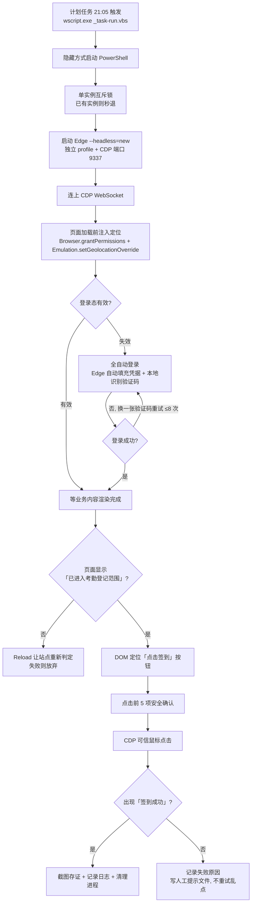

# 宿舍查寝自动签到 · Windows 零窗口方案
 这是一个实现每日全自动签到查寝的项目，全程无窗口，不打扰打游戏！！！

⚠️ 注意只限广州理工学院惠州校区使用

 如需在其他校区使用，请手动更改config.json中的经纬度坐标即可

> 用 **无窗口 Edge + Chrome DevTools Protocol**，在指定时间自动完成「本人账号」的宿舍查寝签到。
> 全程 **不弹窗、不抢前台、不动你的鼠标**，可以边打游戏边签到。

[]()
[]()
[-brightgreen)]()

---

## ⚠️ 免责声明（请先读这一段）

**本项目仅供学习与技术研究使用，且只允许用于「你本人的账号 + 你本人确实在宿舍」这一种场景。**

1. 它只是把你**本来就要做、也完全合规**的那次点击自动化，省掉你掏手机的 30 秒。
2. **严禁用于以下用途**（作者明确反对，且可能违反校纪校规甚至法律）：
   - 替**他人**签到、代签、批量签到；
   - 你**人不在宿舍 / 不在学校**时，用坐标注入伪造"在场"记录；
   - 绕过、对抗学校的考勤制度或信息系统安全机制。
3. **坐标注入不是"作弊工具"，而是"修 bug 的补丁"。** 学校页面依赖浏览器定位，而 Windows 定位服务经常失败（超时）或返回 IP 粗定位（可能偏出十几到上百公里），导致**人在宿舍也被判"不在考勤范围"**。本项目注入的是**你本人真实所在位置**的坐标，用来让页面恢复正确判断。**人不在那个位置时，必须关闭注入或停用任务。**
4. **风险自负。** 使用自动化脚本可能违反学校的信息系统使用规定或考勤管理办法，可能导致**纪律处分、账号封禁、系统风控拦截**等后果。作者不鼓励、不背书任何违规用法，**不对任何使用后果承担责任**。
5. **与学校无关。** 本项目为非官方、非营利的个人技术实践，与任何学校、院系、厂商无关。
6. **不收集任何数据。** 脚本不向任何服务器上报信息；不存储账号密码（登录走浏览器自身已保存的凭据）；所有日志/截图只写在本机。**但请务必不要把运行数据提交到公开仓库**（见下方《发布前检查清单》与 `.gitignore`）。
7. **如学校、系统管理员或作者本人要求，请立即停止使用并删除本项目。**

继续使用即表示你已阅读、理解并同意以上全部内容。

---

## 这个项目是什么

一个**单文件即可跑**的 Windows 自动化工具（PowerShell 5.1 + 系统自带 Edge）：

- 每晚在设定时间（默认 `21:05 / 21:15 / 21:25`，10 分钟间隔重试）自动判断登录态；
- 登录态失效时**全自动登录**（浏览器已存凭据自动填充 + 本地识别算式验证码）；
- 校验定位是否在考勤范围 → 定位在页面上找到「点击签到」→ 用**可信鼠标事件**点击；
- 检测「签到成功」后截图存证，自动清理进程；
- **全程零窗口**：任务动作是 `wscript.exe`（无控制台）+ Chromium `--headless=new`（无窗口）+ 预编译 DLL 内存加载（不派生编译器）。

### 它不做什么（边界）

| 不做 | 说明 |
|---|---|
| 不存密码 | 账号密码由 Edge 自己保存与填充，脚本**不读取、不落盘** |
| 不碰你的浏览器 | 用独立配置目录（`edge-userdata\`），与日常 Edge 互不影响 |
| 不上报数据 | 无任何遥测、无外部服务器、无第三方依赖 |
| 不硬闯 | 任一安全闸门不通过就**放弃点击**（宁可不签，也不误点） |

---

## 原理

### 总览



### 1. 为什么是 headless Edge + CDP，而不是 Selenium / 模拟请求

| 方案 | 问题 |
|---|---|
| 直接模拟 HTTP 请求 | 站点是 SPA + CAS 单点登录 + 动态令牌，逆向成本高且脆弱 |
| Selenium / Puppeteer | 需要装 Python/Node + 驱动，依赖重；无头模式下**无法复用浏览器已保存的密码** |
| 屏幕坐标点击 + 图像识别 | 必须让窗口可见（会打扰你），分辨率/DPI 一变就错位 |
| **headless Edge + CDP（本项目）** | 零依赖（PowerShell 自带 WebSocket 客户端）、**不创建任何窗口**、可用浏览器已存凭据、点击是"可信事件" |

关键点：`--headless=new`（新版无头）是**完整浏览器内核**，因此：

- Edge 的**密码自动填充照常工作**（旧版无头不行）——这是"不存密码也能自动登录"的关键；
- 页面渲染、脚本、定位 API 全部正常；
- Chromium **完全不创建窗口**（不是"把窗口藏起来"，而是根本没有窗口）——所以不可能闪现打扰你。

### 2. 定位注入：修的是"定位不准"，不是"伪造位置"

页面用 `navigator.geolocation` 判断你是否在考勤范围。实测问题：

- Windows 定位服务经常直接超时，或返回 IP 粗定位（实测偏出上百公里）；
- 结果：**人在宿舍，页面照样报「当前不在考勤范围」**，按钮是灰的。

修法（CDP 两个域配合）：

```
Browser.grantPermissions        → 授予页面定位权限（免去授权弹窗）
Emulation.setGeolocationOverride → 在页面加载前把坐标注入为真实值
```

注入后实测：页面文字由「当前不在考勤范围」变为「**你已进入考勤登记范围**」，按钮由灰变蓝。
脚本**只有看到这句话才继续**（配置项 `_定位注入.必须通过`），否则放弃点击。

### 3. 算式验证码识别（本地模板匹配，零依赖）

登录页的验证码是**算术题图片**（如 `7+2=`）。识别流程（纯 PowerShell 实现，无 OCR 库）：

1. **加载**：抓图 → 灰度化（`System.Drawing`）；
2. **二值化 + 连通域分割**：亮度 < 245 视为前景 → 4 邻域连通域（面积 ≥ 6px）→ 按 x 区间重叠合并 → 按间隙二次合并，切出 4 个字形（含 `=`）；
3. **归一化**：每个字形按**自适应阈值**（`min + (255-min)/2`）二值化 → 等比缩放填入 40×40 画布；
4. **特征**：按位打包成 200 字节位图（`BitArray`）；
5. **匹配**：与内置模板库（10 数字 × 2 字体 + 运算符 + 等号，共 23 个）逐一计算
   `Jaccard(按位与/按位或)`，并用"前景占比差"做快速预筛；
6. **判定**：正则约束 `^(\d)([+\-*])(\d)=?$` + 答案必须算术正确 + 最高分与次高分差距（余量）达标；
7. **不确信就换一张**：`minScore < 0.55` 时**绝不瞎填**，刷新验证码重试（最多 8 次），仍失败则回落人工。

> 想适配别的站点？把该站验证码图片丢进 `train-templates.ps1` 即可重建模板库（`templates.cache`）。

### 4. 登录：不再保存密码

- 账号密码**不在本项目任何文件里**，也不在脚本内存里读取——由 Edge 自身保存的凭据自动填充；
- 登录按钮与输入框用 **CDP 可信点击/触摸事件**触发（`Input.dispatchMouseEvent` / `Input.dispatchTouchEvent`），不走"抢前台+真实鼠标"；
- 关闭了"抢前台兜底"时，若后台手势未能触发自动填充，脚本**不会**去抢你的前台，而是提示人工（配置文件可开启兜底）。

### 5. 签到：先证明是"那个按钮"，再点

不靠屏幕坐标硬点，而是**先读页面**：

1. 从 DOM 找「点击签到」元素（`class` → 文本 → 坐标兜底），拿到它的**页面内几何中心**；
2. **点击前 5 项确认**（任一不满足就不点）：
   - 标题属于学工系统；
   - 页面存在「点击签到」；
   - 没有「不在考勤范围」；
   - 未显示「已签到」；
   - 不处于「非考勤时段」。
3. **晚归线守卫**：超过配置时间（默认 `23:00`）直接放弃（`exit 8`），避免留下晚归记录；
4. 点击后用**页面文字**判定结果（而不是按钮颜色——签到成功后按钮也会变灰，和"非考勤时段"无法区分）；
5. 出现「签到成功」→ 截图 + 写日志 + 清理；未出现 → 记录原因，**不反复乱点**。

### 6. 零窗口 & 不打扰（三重保证）

| 层 | 做法 | 效果 |
|---|---|---|
| 任务动作 | `wscript.exe "_task-run.vbs"`（而非直接 `powershell.exe`） | wscript 天生无控制台；PowerShell 以 `SW_HIDE` 启动 |
| 浏览器 | `msedge.exe --headless=new` + 独立 `--user-data-dir` | **不创建窗口**（不是隐藏窗口） |
| 运行期 | 预编译 `Gzist.Win32.dll` **内存加载**（`Assembly.Load(bytes)`），不在运行时编译 C# | 不派生 `csc.exe`，全程**零控制台进程** |

另外：

- **不抢前台、不移动你的鼠标**（所有输入都通过 CDP 发给页面，与真实鼠标无关）；
- 单实例互斥锁（命名 Mutex）：重复触发时第二个实例**立即退出**，不会两个进程抢同一个页面；
- 计划任务设为 `IgnoreNew`（忽略新实例）;
- 实测：50ms 采样监视下，**任务运行期间新增可见窗口 = 0**。

### 7. 计划任务与运维

- 动作：`wscript.exe "_task-run.vbs"`（零控制台）；
- 触发：默认每天 `21:05 / 21:15 / 21:25`（间隔 10 分钟，**已签到会自动跳过**，所以重试是幂等的）；
- 单次时限 `PT15M`，多实例策略 `IgnoreNew`；
- 日志：`signin.log`（带互斥写入，多实例也不会写乱）；
- 截图：`shots\`（签到成功/失败留证，best-effort，绝不阻塞流程）；
- 假期模式：一键停用/恢复（**离校必须停用**，见免责声明第 2 条）。

---

## 快速开始

### 环境要求

- Windows 10 / 11
- PowerShell 5.1（系统自带）
- Microsoft Edge（系统自带）
- **无需** Python / Node / Selenium / 任何第三方库

### 步骤

```text
1) 把本目录放到任意位置（路径不要含特殊权限问题，例如 E:\my-signin） 
2) 建议先跑一次: powershell -ExecutionPolicy Bypass -File build-dll.ps1
      （生成 Gzist.Win32.dll —— 运行期就不必再编译 C#，控制台进程为零；
        不跑也能用，脚本会自动回退到源码编译）
3) 双击  1-首次配置向导(录账号+验证).bat    ← 校准坐标 / 验证定位注入
4) 登录学校统一身份认证，并让 Edge 保存账号密码（勾选"保存"）
5) 双击  3-注册每日自动签到.bat              ← 注册计划任务（默认 21:05/21:15/21:25）
6) 双击  12-一键自检.vbs                     ← 13 项自检，应全部 PASS
```

### 日常

| 想做什么 | 双击 |
|---|---|
| 立刻签到一次（零窗口） | `11-立即签到(零窗口).vbs` |
| 看签到结果 | `6-查看签到报告.bat` |
| 全自动登录演练（只登录，不签到） | `5-全自动登录演练.bat` |
| 一键自检（13 项） | `12-一键自检.vbs` |
| **离校停用 / 回校恢复** | `13-假期模式(离校停用).bat` / `14-恢复自动签到(回校).bat` |
| 抓"到底哪个进程弹窗" | `15-架设窗口监视器(零窗口).vbs` |

---

## 配置说明（`config.json`）

| 配置项 | 说明 |
|---|---|
| `_定位注入.纬度 / .经度 / .精度米` | **改成你本人真实所在位置**；`必须通过=true` 表示定位校验不过就不点 |
| `_时序要求.晚归线` | 超过此时间放弃签到（默认 `23:00`） |
| `_运行.无窗口模式` | `headless`（默认，推荐）；旧值 `可见窗口` 仅用于调试 |
| `_运行.允许可见窗口兜底` | `false`（默认）= 绝不弹窗，失败转人工提示 |
| `_自动登录.验证码最大尝试` | 验证码识别失败时的换图重试上限（默认 8） |
| `_自动登录.置信度阈值` | 识别可信度门槛（默认 0.55），低于此值宁可重试也不瞎填 |
| `_自动登录.允许抢前台兜底` | `true` 允许短暂抢前台以保签到（会打扰全屏游戏）；`false` 绝不抢 |
| `clicks.签到按钮` | 坐标兜底值（优先用 DOM 定位，此值仅在 DOM 找不到时使用） |

---

## 文件说明

| 文件 | 作用 |
|---|---|
| `daily-signin2.ps1` | **主脚本**：流程编排、CDP 客户端、定位注入、登录、点击、安全闸门 |
| `captcha-solve.ps1` | 算式验证码识别（分割 + 模板匹配 + 置信度判定） |
| `templates.cache` | 验证码模板库（23 个字形位图） |
| `train-templates.ps1` | 重新训练模板库（适配其它站点/新字体） |
| `install-task.ps1` | 注册/删除计划任务（含权限自愈） |
| `setup-account.ps1` | 首次配置向导：校准坐标、验证定位、演练登录 |
| `test-autologin.ps1` | 全自动登录演练（只登录，绝不签到） |
| `holiday-mode.ps1` | 假期模式：`-Off` 停用 / `-On` 恢复 / `-Status` 查询 |
| `verify-all.ps1` | 13 项自检（含"零窗口实跑"运行期断言） |
| `window-monitor.ps1` | 50ms 采样窗口侦探：记录任何新窗口 + 归属进程 |
| `redeploy-clean.ps1` | 一键干净重部署（清掉所有旧任务与残留，重新注册唯一任务） |
| `gzist-win32.cs` | Win32 辅助类源码（窗口枚举、DPI、可信输入等） |
| `build-dll.ps1` | 把 `gzist-win32.cs` 预编译成 `Gzist.Win32.dll`（**建议先跑一次**，运行期就不再派生编译器） |
| `_task-run.vbs` | 计划任务的入口（wscript，零控制台） |
| `headless-probe.ps1` | 无头模式探针：验证 `--headless=new` + CDP 在本机可用。**阶段2 会把浏览器已保存的密码库复制到 `%TEMP%\gzist-shadow-profile`** 做只读的"自动填充是否可用"验证（不含 Cookie），**用完即删**，不触碰你的真实登录态 |'
| `DISCLAIMER.md` | 免责声明（详细版，**使用前提**） |

---

## 常见问题

**Q：会不会影响我打游戏 / 看视频？**
A：不会。Chromium 以 `--headless=new` 运行，**不创建窗口**；任务入口是 wscript（无控制台）；所有输入走 CDP，不动你的鼠标、不抢前台。项目内有 `15-架设窗口监视器(零窗口).vbs` 可自行验证（50ms 采样，连闪窗都能抓）。

**Q：我的密码会被保存吗？**
A：不会。脚本不读取也不存储账号密码，登录用 Edge 自己保存的凭据自动填充。

**Q：页面提示"不在考勤范围"怎么办？**
A：先确认真实定位是否失败（Windows 定位常见问题）；若你确实在宿舍而页面误判，用配置里的定位注入修正为真实坐标。
**Q：会不会重复签到 / 点两次？**
A：不会。脚本先判断「已签到」就退出；计划任务 `IgnoreNew` + 脚本内单实例互斥锁，重复触发只会起一个实例。

**Q：签到失败会怎样？**
A：不会乱点。任一闸门不通过就放弃并在日志写明原因；若开启了人工兜底，会写一个提示文件让你手动签。

**Q：能用在别的学校吗？**
A：可以，但需要改：`url`、按钮定位判据、`clicks` 坐标，以及用 `train-templates.ps1` 重建验证码模板库。原理是通用的。

---

## 隐私与安全

- **零网络上报**：脚本不与任何第三方服务器通信；仅访问你配置的学校站点。
- **零第三方依赖**：不需要安装任何包，降低供应链风险。
- **本地数据**：`signin.log`、`shots\`、`edge-userdata\`（浏览器配置目录，内含登录态）都在本机。
- ⚠️ **`edge-userdata\` 内含登录 Cookie，等同于你的登录凭证**：绝不要分享、绝不要提交到 Git。
- 脚本以**当前用户权限**运行，不请求管理员（仅注册/改计划任务时需要一次 UAC）。

---

## 许可

MIT License（见 `LICENSE`）。**但请注意**：MIT 只涉及代码版权，**不免除**使用者遵守本校规章制度与法律法规的义务；本项目附带的《免责声明》为本项目的使用前提。

---

## 致谢 / 声明

- 本项目为个人技术实践，**非官方**，与任何学校、院系、厂商无关。
- 技术栈全部来自系统自带组件（Edge / CDP / PowerShell），未使用任何第三方自动化框架。
- 若本项目冒犯到任何机构或个人的合法权益，请联系删除。
